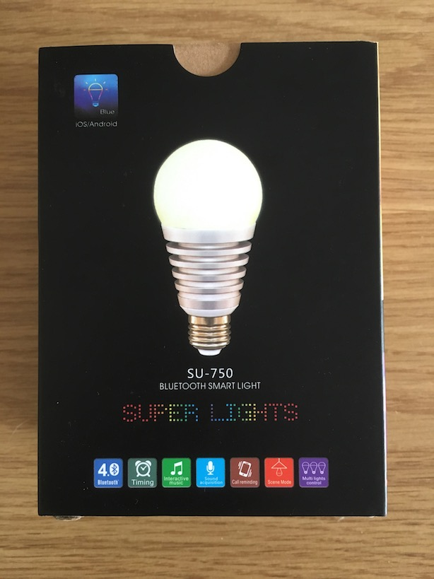

# Homebridge-superlights
Plugin for [Homebridge](https://github.com/nfarina/homebridge) to support the [Superlights/Jasgood Bluetooth light bulbs](https://www.amazon.co.uk/gp/product/B015CMWTYU/).



## Installation
1. Install Homebridge: `npm install -g --unsafe-perm homebridge`
2. Install Noble: `npm install -g noble`
3. Install homebridge-superlights: `npm install -g homebridge-superlights`
4. [Grant Node access to control BluetoothLE discovery](https://github.com/sandeepmistry/noble#running-without-rootsudo): 
``sudo setcap cap_net_raw+eip $(eval readlink -f `which node`)``
5. Configure the plugin

See the Homebridge [installation section](https://github.com/nfarina/homebridge#installation) for more details.

## Configuration

The configuration for this plugin is relatively straightforward; simply add the Bluetooth address of each lightbulb required as a separate accessory in the Homebridge `config.json` file:

```
{
  "bridge": {
    "name": "Raspberry Pi Zero",
    "username": "12:34:56:78:90:AB",
    "port": 51826,
    "pin": "012-34-567"
  },
  "description": "Raspberry Pi Zero Homebridge",

  "accessories": [
    {
      "accessory": "Superlight",
      "name": "Main Bedroom Light",
      "address": "ff:ee:dd:cc:bb:aa"
    }
  ]
}
```

In the above:
* "bridge" is your standard Homebridge configuration
* "accessory" must be "Superlight"
* "address" is the Bluetooth identifier of the bulb
* "name" is a friendly name for the bulb, used by Homekit

## Changelog

### 0.0.1
 * Initial version

### 1.0.0
 * Fixed issue where queries before the bulb is connected would cause a crash
 * Fixed issue where we would continue scanning for devices after the bulb is found
 * Fixed issue where incorrect values were returned from GET calls on characteristics
 * Fixed warning about possible memory leak due to multiple 'read' listeners
 * Added more useful debug information in logging messages
 * Added missing instruction to README regarding Node permissions for BLE access

## Known issues
 * Sometimes BLE scan will disconnect and retry (several times) before the characteristic is found.
 * With the Superlights bulb, brightness values below 10 will turn the bulb off
